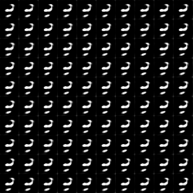
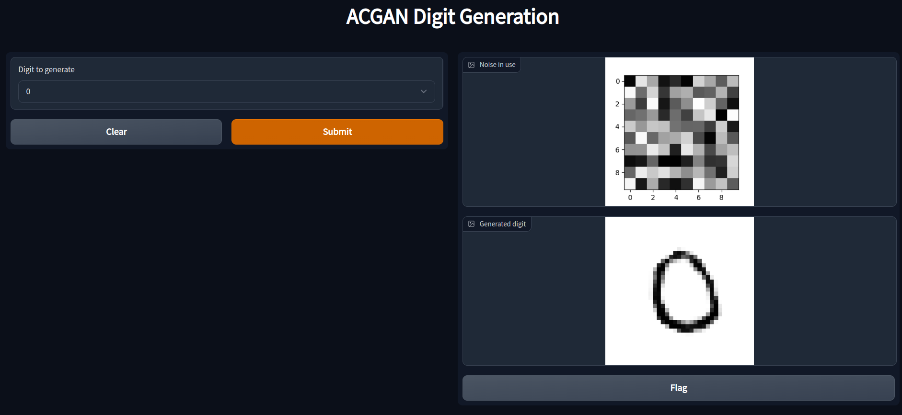
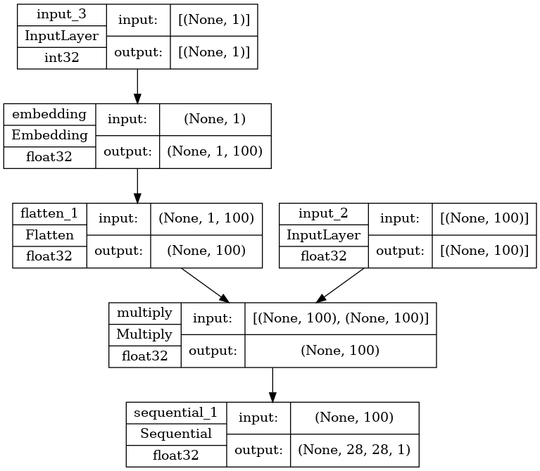
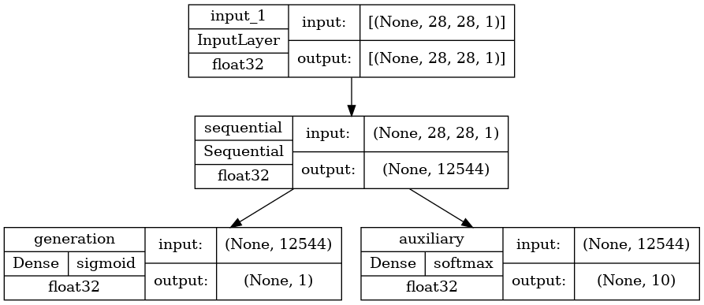
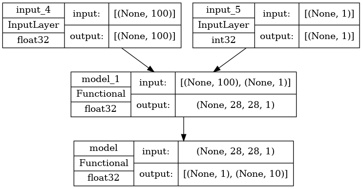
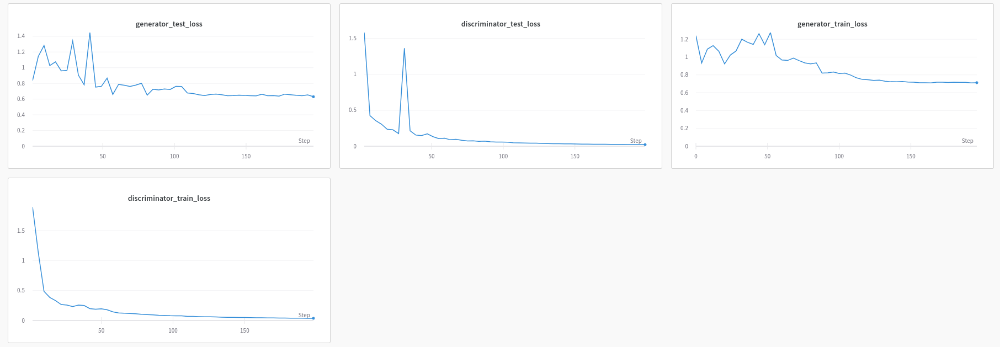
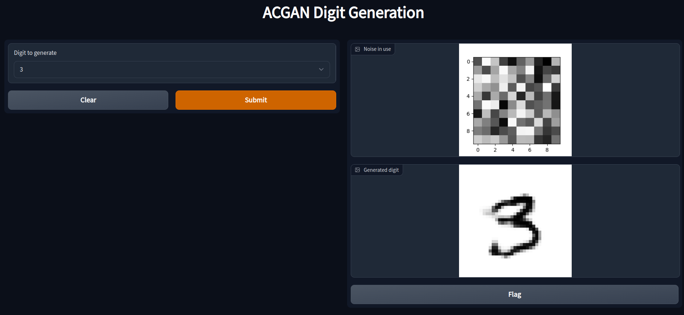

# MNIST Digit Generation with ACGAN
This repository contains the Keras impltementation of MNIST Digit Generation with ACGAN (Auxiliary Classifier Generative Adversarial Network). [Demo](https://www.youtube.com/watch?v=nUAYqLhZB-I)





## Usage :computer:
To try it, run the following commands :

1. Install the necessary python packages :
```
pip install -r requirements.txt
```

2. Train the model with :
```
python train.py
```

3. Then open a terminal and run it :
```
python app.py
```

The app should be usable on localhost in the browser.

## Details
### Dataset
* The deep learning model has been training using the
[**MNIST Digits dataset.**](http://yann.lecun.com/exdb/mnist/)

### Neural Network
#### Model Architecture Description :
The model contains 3 main components:
1. **Generator** : Generates a digit output image from random noise. It also takes into account the class label of the image, since this is an ACGAN.

2. **Discriminator** Classifies whether the generated image is real or fake.

3. **Composite ACGAN** which combines the generator and discrimniator during the learning phase.


### Training
The model has been trained for 50 epochs, and took 1 hour and 10 miutes to learn. 


### Example
We can select a digit to be generated from the dropdown menu, and click on the "Submit" button. In the output, we can see the random noise that has been used as input by the generator, and the output generated digit. 
In the example below, we are generating a "3".

